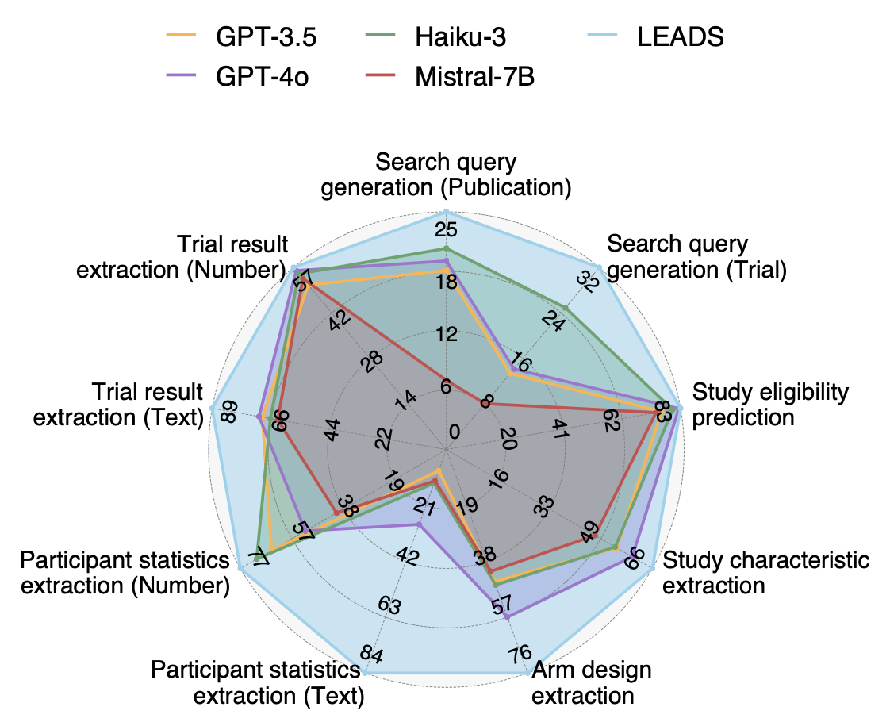

# LEADS

A specialized foundation model for study search, study screening, and data extraction from medical literature.

## Overview

LEADS is an AI foundation model specifically designed for medical literature mining tasks in systematic reviews and meta-analyses. Developed to address the limitations of generic large language models in medical contexts, LEADS excels at three critical tasks:

1. **Study Search**: Formulating precise search strategies to identify relevant clinical trials
2. **Study Screening**: Evaluating publications against inclusion/exclusion criteria
3. **Data Extraction**: Extracting structured information from medical literature

The model is trained on LEADSInstruct, a comprehensive dataset of 633,759 instruction data points curated from:
- 21,335 systematic reviews
- 453,625 clinical trial publications
- 27,015 clinical trial registries

In rigorous evaluations, LEADS consistently outperformed four cutting-edge generic LLMs across six medical literature mining tasks. When integrated into expert workflows, LEADS demonstrated significant improvements in both quality and efficiency:

<p align="center">
  
</p>

- **Study Selection**: Experts using LEADS achieved 0.81 recall (vs. 0.77 for experts working alone) with 22.6% time savings
- **Data Extraction**: Experts using LEADS achieved 0.85 accuracy (vs. 0.80 without LEADS) with 26.9% time savings


## Getting Started

### Prerequisites

- Python 3.8+
- CUDA-compatible GPU with at least 16GB VRAM
- [vLLM](https://github.com/vllm-project/vllm) for efficient model serving

### Installation

1. Clone this repository:
   ```bash
   git clone https://github.com/RyanWangZf/LEADS.git
   cd LEADS
   ```

2. Install dependencies:
   ```bash
   pip install -r requirements.txt
   ```

3. Download the LEADS model from Hugging Face:
   ```bash
   # Install git-lfs if you don't have it already
   apt-get install git-lfs  # For Ubuntu/Debian
   # or
   brew install git-lfs  # For macOS

   # Initialize git-lfs
   git lfs install

   # Clone the model repository
   git clone https://huggingface.co/zifeng-ai/leads-mistral-7b-v1 /path/to/models/leads-mistral-7b-v1
   
   # Alternatively, you can use the Hugging Face CLI
   pip install huggingface_hub
   huggingface-cli download zifeng-ai/leads-mistral-7b-v1 --local-dir /path/to/models/leads-mistral-7b-v1
   ```

## Configuring and Running LEADS

### 1. Configure vLLM

Create a configuration file `llm_server/vllm_config.yaml` with the following settings:

```yaml
dtype: auto
served_model_name: zifeng-ai/leads-mistral-7b-v1
port: 13141
api_key: testtoken
gpu_memory_utilization: 0.6
max_num_seqs: 256
tensor_parallel_size: 1
```

Then create a `.env` file in the root directory to set the endpoint and API key:

```.env
LEADS_ENDPOINT=http://localhost:13141/v1
LEADS_API_KEY=testtoken
MODEL_PATH=zifeng-ai/leads-mistral-7b-v1
CUDA_DEVICE=0
```

### 2. Start the LEADS Server

Use the provided script in `llm_server/vllm_serve.sh`:

Make it executable and run:
```bash
chmod +x llm_server/vllm_serve.sh
./llm_server/vllm_serve.sh
```

### 3. Test the LEADS Server

You can test if the server is running correctly with a simple query:

```python
from openai import OpenAI
import os
from dotenv import load_dotenv

# Load environment variables from .env file
load_dotenv()

client = OpenAI(
    api_key=os.getenv("LEADS_API_KEY"),
    base_url=os.getenv("LEADS_ENDPOINT"),
)

response = client.chat.completions.create(
    model="zifeng-ai/leads-mistral-7b-v1",
    messages=[
        {"role": "user", "content": "What is the PICO framework in evidence-based medicine?"}
    ],
    temperature=0.0,
    max_tokens=1024,
)

print(response.choices[0].message.content)
```

## Use Cases

LEADS specializes in three main tasks for systematic reviews:

### 1. Literature Search

LEADS can help formulate effective search strategies for medical literature:

```python
from leads.api import search_query_generation

pico = {
    "population": "Adults with type 2 diabetes",
    "intervention": "SGLT2 inhibitors",
    "comparison": "GLP-1 receptor agonists",
    "outcome": "Cardiovascular outcomes and glycemic control"
}

search_query = search_query_generation(**pico)
print(search_query)
```

Example output:
```json
['((pulmonary atelectasis) OR (type 2 diabetes AND incretin deficiency) OR (type 2 diabetes AND established cardiovascular disease) OR (type 2 diabetes) OR (type 2 diabetes AND patients uncontrolled on metformin)) AND ((sonographic technique) OR (5-HTQ) OR (empagliflozin) OR (pharmacogenomics) OR (linagliptin))', '((pulmonary atelectasis) OR (type 2 diabetes AND incretin deficiency) OR (type 2 diabetes AND established cardiovascular disease) OR (type 2 diabetes) OR (type 2 diabetes AND patients uncontrolled on metformin)) AND ((saxagliptin) OR (Empagliflozin AND Fixed-Dose) OR (teglazidine) OR (teglazidine AND sulphonylurea) OR (empagliflozin AND SGLT2 inhibitor))', '((pulmonary atelectasis) OR (type 2 diabetes AND incretin deficiency) OR (type 2 diabetes AND established cardiovascular disease) OR (type 2 diabetes) OR (type 2 diabetes AND patients uncontrolled on metformin)) AND ((dapagliflozin))', '((type 2 diabetes AND treatment-naive participants) OR (type 2 diabetes AND Japanese patients AND urine glucose) OR (type 2 diabetes AND older patients) OR (type 2 diabetes AND naive patients) OR (Typical schistosomiasis AND Buruli ulcer AND African hydatid)) AND ((sonographic technique) OR (5-HTQ) OR (empagliflozin) OR (pharmacogenomics) OR (linagliptin))', '((type 2 diabetes AND treatment-naive participants) OR (type 2 diabetes AND Japanese patients AND urine glucose) OR (type 2 diabetes AND older patients) OR (type 2 diabetes AND naive patients) OR (Typical schistosomiasis AND Buruli ulcer AND African hydatid)) AND ((saxagliptin) OR (Empagliflozin AND Fixed-Dose) OR (teglazidine) OR (teglazidine AND sulphonylurea) OR (empagliflozin AND SGLT2 inhibitor))', '((type 2 diabetes AND treatment-naive participants) OR (type 2 diabetes AND Japanese patients AND urine glucose) OR (type 2 diabetes AND older patients) OR (type 2 diabetes AND naive patients) OR (Typical schistosomiasis AND Buruli ulcer AND African hydatid)) AND ((dapagliflozin))', '((type 2 diabetes AND insufficiently controlled) OR (type 2 diabetes AND metformin-treated patients AND metformin-intolerant patients) OR (type 2 diabetes AND established cardiovascular disease) OR (type 2 diabetes AND inadequate glycemic control AND obese patients) OR (type 2 diabetes AND intolerant to metformin)) AND ((sonographic technique) OR (5-HTQ) OR (empagliflozin) OR (pharmacogenomics) OR (linagliptin))', '((type 2 diabetes AND insufficiently controlled) OR (type 2 diabetes AND metformin-treated patients AND metformin-intolerant patients) OR (type 2 diabetes AND established cardiovascular disease) OR (type 2 diabetes AND inadequate glycemic control AND obese patients) OR (type 2 diabetes AND intolerant to metformin)) AND ((saxagliptin) OR (Empagliflozin AND Fixed-Dose) OR (teglazidine) OR (teglazidine AND sulphonylurea) OR (empagliflozin AND SGLT2 inhibitor))', '((type 2 diabetes AND insufficiently controlled) OR (type 2 diabetes AND metformin-treated patients AND metformin-intolerant patients) OR (type 2 diabetes AND established cardiovascular disease) OR (type 2 diabetes AND inadequate glycemic control AND obese patients) OR (type 2 diabetes AND intolerant to metformin)) AND ((dapagliflozin))', '((type 2 diabetes AND established cardiovascular disease)) AND ((sonographic technique) OR (5-HTQ) OR (empagliflozin) OR (pharmacogenomics) OR (linagliptin))', '((type 2 diabetes AND established cardiovascular disease)) AND ((saxagliptin) OR (Empagliflozin AND Fixed-Dose) OR (teglazidine) OR (teglazidine AND sulphonylurea) OR (empagliflozin AND SGLT2 inhibitor))', '((type 2 diabetes AND established cardiovascular disease)) AND ((dapagliflozin))']
```

### 2. Study Screening

LEADS can screen studies based on PICO criteria:

```python
from leads.api import screening_study

pico = {
    "population": "Adult patients (≥18 years) with type 2 diabetes",
    "intervention": "SGLT2 inhibitors",
    "comparison": "Placebo or any active comparator",
    "outcome": "Cardiovascular outcomes including blood pressure changes"
}

abstract = """
[Title] Efficacy and Safety of Canagliflozin in Patients with Type 2 Diabetes: A Randomized Trial
[Abstract] Background: SGLT2 inhibitors represent a novel class of glucose-lowering agents. We evaluated the efficacy and safety of canagliflozin in patients with type 2 diabetes.
Methods: In this 52-week, randomized, double-blind trial, we assigned 258 patients with type 2 diabetes to receive canagliflozin (100mg or 300mg) or placebo. The primary endpoint was change in HbA1c. Secondary endpoints included changes in fasting plasma glucose, body weight, and blood pressure.
Results: Mean age was 56 years. Canagliflozin significantly reduced HbA1c compared to placebo (-0.77% and -1.03% for 100mg and 300mg, respectively; p<0.001). Significant reductions in body weight and systolic blood pressure were also observed. Adverse events included genital mycotic infections and increased urination.
Conclusion: Canagliflozin improved glycemic control, reduced body weight, and lowered blood pressure in patients with type 2 diabetes.
"""

result = screening_study(abstract, **pico)
print(result)
```

Example output:
```json
{
  "evaluations": [
    {"criterion": "Population", "eligibility": "YES", "rationale": "The study includes adult patients with type 2 diabetes with a mean age of 56 years."},
    {"criterion": "Intervention", "eligibility": "YES", "rationale": "The intervention includes canagliflozin, which is an SGLT2 inhibitor."},
    {"criterion": "Comparison", "eligibility": "YES", "rationale": "The study uses placebo as a comparator."},
    {"criterion": "Outcome", "eligibility": "YES", "rationale": "The study reports blood pressure as a secondary outcome, which is a cardiovascular parameter."},
  ]
}
```

### 3. Data Extraction

LEADS can extract structured data from medical studies:

```python
from leads.api import extract_study_characteristics

full_text = """
Title: Efficacy and Safety of Canagliflozin in Patients with Type 2 Diabetes: A Randomized Trial

Abstract: Background: SGLT2 inhibitors represent a novel class of glucose-lowering agents. We evaluated the efficacy and safety of canagliflozin in patients with type 2 diabetes.
Methods: In this 52-week, randomized, double-blind trial, we assigned 258 patients with type 2 diabetes to receive canagliflozin (100mg or 300mg) or placebo. The primary endpoint was change in HbA1c. Secondary endpoints included changes in fasting plasma glucose, body weight, and blood pressure.
Results: Mean age was 56 years. Canagliflozin significantly reduced HbA1c compared to placebo (-0.77% and -1.03% for 100mg and 300mg, respectively; p<0.001). Significant reductions in body weight and systolic blood pressure were also observed. Adverse events included genital mycotic infections and increased urination.
Conclusion: Canagliflozin improved glycemic control, reduced body weight, and lowered blood pressure in patients with type 2 diabetes.
"""

characteristics = extract_study_characteristics(full_text, 
fields_info = [
    "n: number of subjects involved in the study for analysis",
    "condition: the target conditions",
    "intervention: the target interventions"
])
print(characteristics)
```

Example output:
```json
{
  "fields": [
    {"name": "n", "value": 258},
    {"name": "condition", "value": "Type 2 diabetes"},
    {"name": "intervention", "value": "Canagliflozin (100mg or 300mg)"}
  ]
}
```

## Model Limitations

While LEADS demonstrates strong performance on medical literature mining tasks, users should be aware of the following limitations:

- LEADS is specialized for medical literature and may not perform optimally on general domain tasks
- The model's knowledge is limited to its training data and may not reflect the most recent medical research
- As with all AI systems, outputs should be reviewed by qualified medical professionals before making clinical decisions

## References

If you find this useful, please consider citing our paper:

```bibtex
@article{wang2025foundation,
  title={A foundation model for human-AI collaboration in medical literature mining},
  author={Wang, Zifeng and Cao, Lang and Jin, Qiao and Chan, Joey and Wan, Nicholas and Afzali, Behdad and Cho, Hyun-Jin and Choi, Chang-In and Emamverdi, Mehdi and Gill, Manjot K. and Kim, Sun-Hyung and Li, Yijia and Liu, Yi and Ong, Hanley and Rousseau, Justin and Sheikh, Irfan and Wei, Jenny J. and Xu, Ziyang and Zallek, Christopher M. and Kim, Kyungsang and Peng, Yifan and Lu, Zhiyong and Sun, Jimeng},
  journal={arXiv preprint arXiv:2501.16255},
  year={2025}
}
```

## License

This project is licensed under the [MIT License](LICENSE).

## Acknowledgements

We thank all the clinicians and medical researchers who participated in our user studies and provided valuable feedback. We also acknowledge the contributions of the Mistral 7B model and the vLLM project, which made this work possible.
